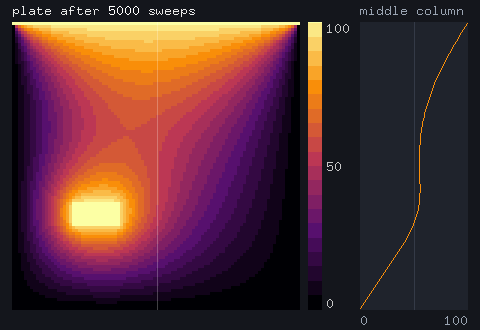

# CAIRN

CAIRN is a systems programming language for code that AI agents write and people review. One source compiles to C++20 for the CPU and to CUDA for NVIDIA GPUs. The compiler refuses races and uses of moved values before anything runs, traps on overflow and out-of-bounds access instead of corrupting memory, and writes down what each function costs: allocation, threads, I/O, device work.

## Why an agent would use it

- A race, a use after move, a leaked task or two mutable borrows of one array is a compile error with a stable code (`E-LEASED` below) and a rule card that says how to fix it.
- Every function has an inferred effect row (`alloc`, `spawn`, `io`, `write:data`, `trap`, ...). A signature can cap it with `pure` or `effects(...)`, so an edit that adds an allocation or a thread where none was allowed is refused.
- There are no lifetime annotations. A borrow exists only as a parameter; anything stored is an owner, an index or a handle.
- An edit session hands the agent one function's source and the interfaces around it, and admits a new body only if the signature and the effect ceiling still hold.
- `cairn diff OLD NEW` says, function by function, whether a change compiled to identical code, is SMT-equivalent, or changed behaviour, with an input that shows the difference.
- `cairn predict` prices a function on this machine without running it, and `cairn shot` returns the frames a UI drew as PNGs.

These are properties of the design, checked by the tests and proofs listed under [limitations](#limitations-and-what-you-trust). They do not yet make a model cheaper to use. In a preregistered equal-budget benchmark ([bench/ai](bench/ai/PREREGISTRATION.md)), `claude-sonnet-5` solved all ten small systems tasks in CAIRN, C++ and Rust (20 of 20 in each), so the run cannot tell the languages apart by tasks solved. The CAIRN subjects, who had never seen the language and read its documentation inside the budget, used 11.6 times the tokens of the C++ subjects and 12.3 times those of the Rust subjects ([results](evidence/v0_9/ai_benchmark/RESULTS.md)).

## Example

```cairn
// Two tasks fill the two halves of an array, then main adds it up.
fn fill(n:usize, out:rw<u64>[n], start:u64) {
  for i in 0..n { out[i] = start + u64(i); }     // checked: an overflow traps
}

fn halves(n:usize, data:rw<u64>[n]) {
  let mid = n / 2;
  let left = spawn fill(data[0..mid], 0);        // left holds data[0..mid] until wait
  let right = spawn fill(data[mid..n], u64(mid));
  wait(left);
  wait(right);
}

fn main() -> i32 {
  let mut data = Buf[u64](1000);                 // an owner, released at scope exit
  halves(data);                                  // n is len(data)
  let total = reduce + for i in len(data) yield data[i];
  println("total = ", total);
  return 0;
}
```

`rw<u64>[n]` is a mutable borrow of `n` elements, and `n` is part of the type. The two tasks may run at once because `data[0..mid]` and `data[mid..n]` meet at `mid` without overlapping. `cairn doc` prints what each function costs:

```cairn fragment
fn fill(n:usize, out:rw<u64>[n]@host, start:u64)  // effects: ffi_precondition, trap, write:out

fn halves(n:usize, data:rw<u64>[n]@host)  // effects: ffi_precondition, join, spawn, trap, write:data

// effects: alloc, ffi:write, ffi_precondition, free, io, join, local_read, local_write, spawn, trap, zero_init
fn main() -> i32
```

Touch the array while a task still holds it, and the program does not compile:

```cairn rejects E-LEASED
fn fill(n:usize, out:rw<u64>[n], start:u64) { for i in 0..n { out[i] = start + u64(i); } }

fn halves(n:usize, data:rw<u64>[n]) {
  let left = spawn fill(data[0..n], 0);
  data[0] = 7;                                   // touches what left still holds
  wait(left);
}
```

```text
error[E-LEASED]: data is lent to left until wait(left).
  --> racy.cairn:5:3
  |
5 |   data[0] = 7;                                   // touches what left still holds
  |   ^^^^
```

A `parallel` body runs as CUDA lanes when its views live on the device, and on a pool of host threads when they do not. A lane may write only element `[i]` of what it writes, so two lanes never race:

```cairn
fn saxpy(n:usize, out:rw<f32>[n]@device, x:ro<f32>[n]@device, y:ro<f32>[n]@device, a:f32) {
  parallel i in n { out[i] = a * x[i] + y[i]; }
}
```

## Install

You need Linux on x86-64 or AArch64, Python 3.11 or later, and Clang or GCC with C++20. The compiler has no third-party Python dependency.

```sh
git clone https://github.com/SamMausberg/cairn && cd cairn
python3 -m venv .venv && . .venv/bin/activate
pip install -e .                   # '.[dev]' adds pytest, ruff and mypy
cairn doctor                       # which optional tools are present
```

In Claude Code, `claude plugin marketplace add SamMausberg/cairn` and `claude plugin install cairn@cairn` add the CAIRN skill, the `cairn` command and the language server ([agents.md](docs/agents.md#the-skill-and-the-claude-code-plugin)).

`python3 bin/cairn` runs the same command line without installing. Optional tools switch on more checks and are never downloaded: `libz3` for `verify` and `diff`, CUDA `nvcc` for device code, Lean 4 for `proofs/`, `qemu-system-aarch64` for the bare-metal target.

## Run

```sh
cairn run first.cairn              # the example above, saved as first.cairn: total = 499500
cairn doc first.cairn              # each function's signature and effect row
cairn new my_project && cairn run my_project
cairn test examples/systems        # test blocks and finite task contracts, each in its own process
cairn run examples/apps/kvstore    # a crash-safe storage engine
cairn graph examples/apps/analytics  # the module graph with source and interface hashes, for other build systems
```

Bazel rules are in [bazel/](bazel/), with an example in [examples/bazel](examples/bazel). [docs/tools.md](docs/tools.md) covers every command, and [the guide](docs/guide.md) goes from a fresh checkout to twelve complete programs.

## Demos

Three demos, each one command from a fresh checkout. `tests/projects/test_demos.py` runs them again, so they cannot go stale.

| Demo | What you see | Command |
|---|---|---|
| [repair](demos/repair/README.md) | An agent fixes a bug through the edit host. The host refuses a debug print (`E-EFFECT-EXPANSION`) and a tidy-up that changes behaviour (`E-PRESERVE`, with the input `x = 0, lo = 16, hi = 12`). `cairn diff` then reports the fixed function as changed at `us = 100`, the tidied one as SMT-equivalent, and a major version bump. | `make demo-repair` |
| [numeric](demos/numeric/README.md) | A 1024 x 1024 heat-plate sweep written once runs on host threads and as CUDA lanes. The host result stays within 0.0000148 of an f64 reference, against a stated bound of 0.0048, and has the same bits as a plain C++ loop. The device half compiles for sm_120 and has not run yet. | `make demo-numeric` |
| [visual](demos/visual/README.md) | An agent asks what a program draws, reads in the layout record that a colour bar covers the plot, moves it, and gets back the new frames and the effect rows the edit changed (none). | `make demo-visual` |



The agents in the demos are scripted replies, replayed; everything the host, the compiler, Z3 and the programs say is computed on each run. `python3 demos/repair/run.py --live MODEL` sends the same packets to a real model.

## Limitations and what you trust

CAIRN is beta software, developed and measured on one machine. The language can still change between releases.

The compiler is not proved correct. The checker and the C++ emitter are about 8,100 lines of Python (`src/cairn/compiler`), and the runtime is about 2,600 lines of C++ headers (`src/cairn/runtime`). The Lean proofs are about models written by hand beside that code. Differential tests compare the models with the checker on generated programs, which shows agreement on samples, not that the Python implements the model.

| You trust | For | Checked by |
|---|---|---|
| The Python parser, checker and emitter | every program | about 3,800 tests, rejection tables from seven adversarial reviews, differential runs against the Lean models |
| The runtime headers | owners, threads, the lane pool, rings, device calls | native runs under Clang and GCC with the address, leak, undefined and thread sanitizers |
| Clang or GCC, and nvcc | native and device code | nothing in this repository |
| `unsafe` blocks and `extern` declarations | the foreign boundary, MMIO, inline assembly | the effects they declare, which are trusted as written |
| Z3 and the SMT translator | `cairn verify` and `cairn diff` | tests of the translator; anything outside the modeled fragment is `unknown` |
| The Lean kernel | the proofs in `proofs/` | an axiom audit: `propext` and `Quot.sound`, nothing else |

What has not been validated:

- Most of the GPU side has not run on a GPU. Device lanes, transfers and three kernels ran on one RTX 5070 Ti (`evidence/v1_3/gpu`). Vector loads, shared-memory staging, device plans, `mma_unordered`, the device `scan` and the reusable execution context compile for sm_120 and are checked on the host only, and the execution context is not yet used by the generated code. The device half of `cairn predict` is NVIDIA's published specification, not a measurement.
- Host performance was measured on one 16-thread x86-64 machine against plain C++, OpenMP and oneTBB at equal guards. Nothing is claimed against tuned C++ or CUDA.
- SMT equivalence covers a fragment. An owner inside a record or an array, concurrency, device memory, the foreign boundary, storage floats and loops it cannot bound are `unknown`, and `unknown` is never reported as success.
- The AI evidence is one model family on small tasks. The equal-budget benchmark gave ten single-file tasks to one model, which also wrote the language and the tasks; every subject solved its task, so it measured cost and not difficulty. Most of CAIRN's extra tokens went to reading its documentation. An earlier pilot had no comparison arm (`evidence/v1_1/ai_pilot`).
- Linux only. There is no package registry and no fetching; the package is not on PyPI. The bare-metal AArch64 target runs only under QEMU on an AArch64 host.

## What is established

| Claim | Kind | Where |
|---|---|---|
| An accepted program of the ownership and lease calculus has no use after move or free, double free, leaked task, aliased argument or data race, under any interleaving, and never gets stuck. | Lean-checked model | `proofs/Cairn/Ownership/` |
| The lane pool runs each index of a host region once and returns only when no worker is inside. | Lean-checked model | `proofs/Cairn/Region.lean` |
| A guard the compiler leaves out cannot fail where the checker's facts hold. Each left-out guard is also re-derived by an independent audit, and conservative and optimized builds agreed on 174,816 cases per compiler. | Lean-checked rule, audited, finite-tested | `proofs/Cairn/Facts.lean`, `evidence/v1_4/guards` |
| The collector's seventeen arithmetic certificates hold, and its loop model stores in bounds. | Lean-checked | `proofs/Cairn/Collector.lean` |
| A host `parallel` region runs level with OpenMP and oneTBB at equal guards and worker counts. | Benchmarked, one machine | `evidence/v1_4/bench` |
| `cairn predict` ranks held-out host timings with a Kendall tau of 0.87 to 0.92, at a median error of 28 to 44 percent. | Benchmarked, one machine | `evidence/v1_4/perf_model` |
| At equal budgets on ten small tasks, `claude-sonnet-5` solved 20 of 20 in each of CAIRN, C++ and Rust, and used 11.6 times the tokens in CAIRN that it used in C++. | Benchmarked, one model, preregistered | `evidence/v0_9/ai_benchmark` |

[docs/verification.md](docs/verification.md) says what each proof, model and test covers and what it leaves out.

## The language

- Checked integer arithmetic, explicit conversions, and wrapping forms that say so by name.
- Records, sums with exhaustive `match`, `try` for errors, generics with trait and kind bounds, closures that never escape, modules and projects with vendored dependencies.
- Owners that move and are released at scope exit, `linear` values consumed exactly once, `take`, `swap` and `defer`.
- Tasks with leases down to one field, task groups, I/O rings, atomics and mutexes.
- `parallel`, `reduce`, `compact` and `scan` on host threads or CUDA lanes, plans that change how a region runs without changing its result, and placement types (`@host`, `@pinned`, `@unified`, `@device`).
- Storage floats (`f16`, `bf16`, `f8e4m3`, `f8e5m2`) with one stated rounding, `quantize`, and `derive grad`, which writes a reverse-mode derivative as ordinary checked code.
- Test blocks and `assert` in the language, and a standard library written in CAIRN: collections, text, formatting, files, sockets, `zlib`, images and 2D drawing.
- `extern` with mandatory effects behind an `unsafe` gate, a freestanding AArch64 target, and a generated C header for calling a CAIRN library from C or C++.

## Documentation

[docs/](docs/README.md) indexes the reference: the language, memory, abstractions, concurrency and numerics, the standard library, the tools, verification, the agent protocol and the roadmap. [AGENTS.md](AGENTS.md) has the rules for anyone, human or agent, changing this repository, and [CHANGELOG.md](CHANGELOG.md) is the release history.

## Repository

```
src/cairn/     compiler/ runtime/ std/ verify/ agent/ editor/ perf/ projects/ templates/ targets/
skills/        cairn/: the Agent Skill, generated from the compiler's rule cards
proofs/        Lean 4: collector certificates, ownership and lease calculus, lane pool, guard elision
demos/         the three demos above
examples/      runnable projects: hello/ systems/ apps/ interop/ embedded/ bazel/, and inputs for the tools
bazel/         rules_cairn: Bazel rules for CAIRN libraries, binaries and tests
tests/         the suite: language/ soundness/ verification/ projects/ runtime/ tooling/ agent/
tools/         checks/ ai/ corpus/ release/
bench/         suite/ host/ codegen/ gpu/ benchmark harnesses, and ai/, the equal-budget AI benchmark
editors/       VS Code and Vim support, generated from the compiler's vocabulary
docs/          the documentation
evidence/      executed results by release, with their limits
```

## License

CAIRN is licensed under either the [MIT license](LICENSE-MIT) or the [Apache License, Version 2.0](LICENSE-APACHE), at your option. Contributions are accepted under the same terms. [CONTRIBUTING.md](CONTRIBUTING.md) has the working agreement, and [SECURITY.md](SECURITY.md) says how to report a soundness bug.
