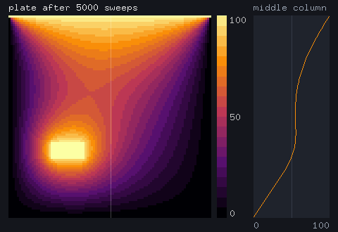

# CAIRN

CAIRN is a systems language for the CPU and NVIDIA GPUs, designed to be written by AI agents. It compiles to C++20 and CUDA.

Its compiler refuses data races before a program runs, including races between the threads of a GPU kernel. In C++ and CUDA a race is found at run time, if at all: by a sanitizer watching a run that reaches it, or as a wrong answer. In CAIRN the program does not compile, and the refusal says which threads conflict and where the fix goes, which an agent can act on without running anything.

In the kernel below, each block of 256 threads reverses one tile of an array through shared memory, the fast memory that the threads of one block share:

```cairn
// Each block of 256 threads reverses one tile of x into out: 256 elements, or the last few of x.
fn reverse_tiles(g:usize, n:usize, out:rw<f32>[n]@device, x:ro<f32>[n]@device) {
  blocks b in g threads t in 256 {
    shared tile:f32[256] = zeroed;
    let i = b * 256 + t;
    let short = b * 256 + 256 - min(n, b * 256 + 256);  // how many of the tile's 256 lie past n
    if t >= short { tile[t] = x[i - short]; }           // a short tile fills the top of tile
    barrier;                                            // every thread's element is in place
    if i < n { out[i] = tile[255 - t]; }
  }
}
```

Delete the barrier and the program no longer compiles. The compiler runs the block's body for every thread, finds the pair of threads that conflict, and says where the barrier goes:

```text
error[E-COOP-UNORDERED]: thread t = 255 reads tile[0] at line 8, which thread t = 0 writes at line 7 in the same phase: nothing makes the write happen first. Put a barrier after line 7 and before line 8 runs.
  --> racy.cairn:8:25
  |
8 |     if i < n { out[i] = tile[255 - t]; }
  |                         ^^^^
  = note: the cooperative card states this rule: cairn rules E-COOP-UNORDERED
```

A region written `blocks ... threads ...` is a cooperative region: CAIRN's form of a CUDA kernel whose threads share memory and meet at barriers. The compiler also checks the blocks of a launch against each other. If every block wrote `out[t]`, two blocks would write the same element, and the kernel would be refused with `E-COOP-GLOBAL`.

## What the compiler refuses

Each of these is refused before the program runs, under a stable diagnostic code:

- two threads of a block touching one shared element between barriers, where either of them writes (`E-COOP-CONFLICT`, `E-COOP-UNORDERED`, `E-COOP-REUSE`)
- a barrier or warp operation that some thread of the block does not reach (`E-COOP-BARRIER`, `E-COOP-WARP`)
- two blocks writing one element of global memory (`E-COOP-GLOBAL`), or two lanes of a `parallel` region writing one element (`E-PARALLEL-RACE`)
- touching data a running task still holds (`E-LEASED`), using a value after it moved (`E-MOVED`), passing one array as two mutable borrows (`E-ALIAS`)
- a function doing something its signature does not allow, such as allocating memory or spawning a task inside `pure` code (`E-EFFECT-CEILING`)

Integer overflow, division by zero and out-of-bounds indexing are checked at run time instead, by guards the compiler writes into the program and leaves out only where it can show they cannot fail. A failed guard aborts the program before the operation it guards.

Inside a GPU kernel a failed guard traps the kernel and poisons the device context, so nothing queued after it runs and no copy can read what the kernel wrote. A CAIRN program then aborts at its next wait ([devices.md](docs/devices.md#one-wait-or-none)). That device path is tested under `--emulate`, and no test that makes a guard fail on a GPU has run since 0.8.3. On a GH200 a guard did fail in a kernel the CUDA compiler had miscompiled, and the program aborted as described ([evidence/v1_2/gpu_gh200](evidence/v1_2/gpu_gh200/README.md)).

## The same rules on the CPU

In this program two tasks, each on a thread of its own, fill the two halves of one array at once:

```cairn
fn fill(n:usize, out:rw<u64>[n], start:u64) {
  for i in 0..n { out[i] = start + u64(i); }     // checked: an overflow traps
}

fn halves(n:usize, data:rw<u64>[n]) {
  let mid = n / 2;
  let left = spawn fill(data[0..mid], 0);        // left holds data[0..mid] until wait
  let right = spawn fill(data[mid..n], u64(mid));
  wait(left);
  wait(right);
}

fn main() -> i32 {
  let mut data = Buf[u64](1000);                 // an owner, released at scope exit
  halves(data);                                  // n is len(data)
  let total = reduce + for i in len(data) yield data[i];
  println("total = ", total);
  return 0;
}
```

`rw<u64>[n]` is a mutable borrow of `n` elements, and `n` is part of its type. A task leases what it borrows until its `wait`: until then nothing else may write what the task reads or touch what it writes. The two tasks may run at once because `data[0..mid]` and `data[mid..n]` do not overlap. Writing `data[0] = 7;` before `wait(left)` is refused with `E-LEASED`.

A `parallel` region runs its body once for each index, and each run is a lane. The lanes run as CUDA threads when the region's arrays live on the device, and on a pool of host threads when they do not. A lane may touch an array that any lane writes only at its own index `[i]`, or inside its own block `[i * S + j]` with `j` below a constant `S`, so two lanes never race:

```cairn
fn saxpy(n:usize, out:rw<f32>[n]@device, x:ro<f32>[n]@device, y:ro<f32>[n]@device, a:f32) {
  parallel i in n { out[i] = a * x[i] + y[i]; }
}
```

## The rest of the language

- Checked integer arithmetic, explicit conversions, and wrapping forms that say so by name.
- Records, sums with exhaustive `match`, `try` for errors, generics with trait and kind bounds, closures that never escape, modules and projects with vendored dependencies.
- Owners that move and are released at scope exit, `linear` values consumed exactly once, `take`, `swap` and `defer`.
- Tasks with leases down to one field, task groups, I/O rings, atomics and mutexes.
- `parallel`, `reduce`, `compact` and `scan` on host threads or CUDA lanes, plans that change how a region runs without changing its result, and placement in the type (`@host`, `@pinned`, `@unified`, `@device`).
- Cooperative regions with shared memory, barriers, warp shuffles and pipeline stages, checked by the phase rule; layouts with checked coverage; fragments for the tensor cores.
- Alternative implementations of a function, chosen by a plan, with the reference as the fallback.
- Storage floats (`f16`, `bf16`, `f8e4m3`, `f8e5m2`) with one stated rounding, `quantize`, and `derive grad`, which writes a function's derivative in reverse mode as ordinary checked code.
- Test blocks and `assert` in the language, and a standard library written in CAIRN: collections, text, formatting, files, sockets, `zlib`, images and 2D drawing.
- `extern` with mandatory effects behind `unsafe`, typed inline assembly for x86-64, AArch64 and PTX, vendored C++ and CUDA as foreign implementations, a freestanding AArch64 target, and a generated C header for calling a CAIRN library from C or C++.

The language is at 1.1.0, and a later major version may still change it.

## Written for agents, and by them

The compiler's answers are meant to be acted on without reading the manual. One `cairn check` reports every independent error, each with a stable code, a line and column, a message that says which rule was broken, and the rule card that states the rule, which `cairn rules CODE` prints. The first error is always the one a check that stops at the first error would give.

Every function has an inferred effect row, the list of what it may do, such as `alloc`, `spawn`, `io`, `write:out` or `trap`. `cairn doc` prints it, and a signature can cap it, so an edit that adds an allocation where none was allowed is refused.

Two commands answer what agents in the [1.1 evaluation](#agents) spent requests looking for. `cairn find` names the functions to call, given words or the types of the values in hand, and `cairn run --sanitize address` or `--sanitize thread` builds and runs a program under that sanitizer in one command.

A slow function stays as the reference, and a faster version is written beside it as an implementation: `fn g(...) implements f when n % 4 == 0 { ... }`. `cairn validate` tests it against the reference on generated edge cases, and `cairn tune` chooses among validated implementations and plans, which change how a region runs without changing its result, within compile and run budgets. `cairn diff OLD NEW` gives each function of two versions a class: identical code; SMT-equivalent, where Z3 found no input that tells the two apart within the fragment it models; changed, with an input that shows the difference; or unknown, which is never counted as unchanged.

The compiler's edit, plan and implementation sessions reach agents without a shell through `cairn mcp`, and the repository is a Claude Code plugin that adds the skill, the `cairn` command, the language server and those tools. After an edit of one function's body, the sessions and the language server check that body alone against the record the last check kept, then run the rules that span the whole program again, and a differential test requires the same answer as a whole check.

The aim is that an agent reaches a correct program in fewer tokens than in C++ or Rust, and a fast one sooner, without the compiler giving up a check. That is not established, and so far CAIRN has cost agents more ([the evidence](#agents)). AI agents (Claude Code) also wrote most of CAIRN's compiler, runtime, tests and documentation, working to one maintainer's design, under the rules in [AGENTS.md](AGENTS.md).

## Install

You need Linux on x86-64 or AArch64, Python 3.11 or later, and GCC 11 or later or Clang 13 or later. The compiler has no third-party Python dependency. CAIRN is installed from a checkout: it is not on PyPI, and there is no package registry for its libraries.

```sh
git clone https://github.com/SamMausberg/cairn && cd cairn
python3 -m venv .venv && . .venv/bin/activate
pip install -e .                   # '.[dev]' adds pytest, ruff, mypy and setuptools
cairn doctor                       # which optional tools are present
```

For Claude Code, install the plugin. Other agents load `skills/cairn/`, which is in the Agent Skill format, or connect to `cairn mcp` ([agents.md](docs/agents.md#the-skill-and-the-claude-code-plugin)).

```sh
claude plugin marketplace add SamMausberg/cairn
claude plugin install cairn@cairn
```

Each optional tool turns on more checks, and CAIRN never downloads one: `nvcc` from CUDA 12.9 or later for device code, `libz3` for `verify` and `diff`, Lean 4 for `proofs/`, and `qemu-system-aarch64` for the freestanding AArch64 target, which needs no operating system and has so far run only under QEMU on an AArch64 host.

## Run

```sh
cairn run first.cairn              # the CPU example above, saved as first.cairn: total = 499500
cairn doc first.cairn              # each function's signature and effect row, the list of what it may do
cairn new my_project && cairn run my_project
cairn test examples/systems        # test blocks and task contracts, each in its own process
cairn run examples/apps/kvstore    # a storage engine that recovers from a torn log
```

[docs/guide.md](docs/guide.md) goes from a fresh checkout to twelve complete programs, and [docs/tools.md](docs/tools.md) covers every command.

## GPU work without a GPU

Most of the cycle of writing, testing and tuning a kernel runs on a machine with no GPU:

```sh
cairn run examples/cooperative/gpu.toml --emulate --device-target sm_120   # device code on host threads
cairn cards                                                                # the GPUs cairn predict can price
cairn predict examples/cooperative/gpu.toml --card all                     # a time per function on each of them
cairn tune examples/cooperative/tuned.toml --symbol row_totals --card h100 --at rows=64,cols=1e5   # candidates compiled for sm_90a, priced on an H100
```

`--emulate` judges the program against a real device target, such as `sm_120`, and runs all of its device work on host threads: regions, `reduce`, `compact` and `scan`, cooperative regions and transfers. `cairn test` and `cairn validate` then check a kernel's logic without a GPU, and the host build can run under the address and thread sanitizers. Every device example that `--emulate` accepts gives the same results under it as its host build or reference loop, under Clang and GCC ([evidence/v1_1/emulation](evidence/v1_1/emulation/README.md)). An emulated run is still a run on host threads: it is not a run on the device, and it measures no time. What the host cannot run as the device would, such as a vendored CUDA kernel, is refused with `E-EMULATE`.

`cairn predict` prices device work from the published specifications of eight GPUs, from the A100 to the B200 and the RTX 5090. `cairn tune` compiles its candidates for that GPU's target and reads their registers and shared memory from ptxas, with nothing launched. These are predictions from datasheets and compiler reports, and none of the eight cards has been checked against a measurement.

A device library's C header gives each function whose effects the host cannot observe a `cq_NAME(stream, ...)` entry. The entry queues the function's work on the caller's CUDA stream and returns without waiting, so PyTorch or any CUDA program can call it or capture it in a CUDA graph. `cairn export --harness sol-execbench|gpumode|kernelbench` packages a function as a submission for that benchmark, bound to PyTorch's current stream. It writes the files and prints the command, and it never submits or runs anything.

## Demos

Each demo is one command from a fresh checkout, and `tests/projects/test_demos.py` runs all four.

| Demo | What it shows | Command |
|---|---|---|
| [repair](demos/repair/README.md) | An agent fixes a bug through the edit host. The host refuses a debug print (`E-EFFECT-EXPANSION`) and a tidy-up that changes behaviour (`E-PRESERVE`, with the input that shows it). `cairn diff` then reports the fix as a behaviour change, the tidy-up as SMT-equivalent, and a major version bump. | `make demo-repair` |
| [numeric](demos/numeric/README.md) | A sweep of a 1024 x 1024 heat plate, written once, runs on host threads and as CUDA lanes. The host result stays within 0.0000148 of an f64 reference, against a stated bound of 0.0048. On an RTX 5070 Ti the device half gave the host's bits. | `make demo-numeric` |
| [visual](demos/visual/README.md) | An agent asks what a program draws, finds in the layout record that a colour bar covers the plot, moves it, and gets back the new frames. | `make demo-visual` |
| [implement](demos/implement/README.md) | An agent writes faster implementations of a sum of squares through `cairn mcp`. A looser tolerance is refused (`E-TOLERANCE`), a candidate that drops the tail fails validation at `n = 5`, and `cairn tune` times the valid ones and keeps the fastest. | `make demo-implement` |



The demo agents are scripted. What the host, the compiler, Z3 and the programs report is computed on each run.

## The evidence so far

CAIRN keeps eight kinds of claim apart: accepted, typed, native-built, finite-tested, sanitizer-clean, SMT-equivalent, Lean-checked and benchmarked. [verification.md](docs/verification.md#the-eight-claims) defines each, and a result supports only the claim it names. Most of 1.1.0's records were taken on one x86-64 machine under WSL2.

### Agents

Two evaluations have measured what CAIRN costs an agent, the second only in part, and in both it cost more than C++. The preregistered 1.0 benchmark, run before the plugin existed, gave `claude-sonnet-5` ten small systems tasks in each of CAIRN, C++ and Rust, twice over. Every subject solved its task, so the run cannot tell the languages apart by tasks solved. CAIRN subjects, who had never seen the language and read its documentation inside the budget, used 11.6 times the tokens of C++ subjects and 12.3 times those of Rust subjects ([results](evidence/v1_0/ai_benchmark/RESULTS.md)).

The 1.1 evaluation added the plugin as an arm of its own and stopped early, at 54 of its 156 subjects. Again every subject solved its task, and per solved task the plugin arm used 5.5 times C++'s tokens and the documentation arm 8.2 times ([partial results](evidence/v1_1/ai_eval/RESULTS.md)). The two runs differ in design, so the difference between them is not a measured improvement.

[The transcripts of that run](evidence/v1_1/friction/README.md) show where the tokens went. Every CAIRN subject's first program that type-checked was correct. Learning the language before writing took 80 percent of the documentation arm's tokens and 67 percent of the plugin arm's, against 17 percent in C++. The rest went to refusals, several of them of correct programs, and to testing, including finding the build with the sanitizers.

Release 1.1.0 changed the causes that cost the most, and on the 69 programs those subjects checked it gives 16 refusals where the compiler before those changes gave 30. No model has been run on 1.1.0, so nothing shows that agents now spend less. All of this is one model family on small tasks, and that family also wrote much of the language and the tasks.

### Correctness

The compiler is not proved correct. The Lean proofs in `proofs/` cover models written by hand beside it: the ownership and lease calculus, the phase rule of cooperative regions, the host lane pool, the rule for leaving a guard out, layouts and the loop `compact` lowers to. Differential tests compare those models with the Python checker on generated programs, which shows that they agree on samples and not that the checker implements the model.

The suite builds accepted programs under Clang and GCC and runs them under the address, leak, undefined-behaviour and thread sanitizers. Adversarial reviews have found accepted programs that should have been refused, and each one found is kept as a test in `tests/soundness/`. [verification.md](docs/verification.md#what-you-trust) says what you trust and what checks each part, and what each proof, model and test leaves out.

SMT equivalence covers a fragment of the language that leaves out, among other things, concurrency, device memory, the foreign boundary and storage floats. What falls outside it is `unknown`, which is never reported as success. `cairn validate` is finite testing on generated inputs, against a reference compiled by the same compiler.

### Devices

Device code has run on a rented GH200 for the 0.8.0 to 0.8.2 records, on an RTX 5070 Ti under WSL2 since 0.8.3, and on a headless GH200 in the work after 1.1.0. In the session that released 1.1.0, 48 of the suite's 52 tests that run device code passed on the RTX 5070 Ti, each checking its results against the host or a reference. They ran device plans, wide loads and stores, atomics, cooperative regions with their finish, votes and pipeline stages, tensor-core multiplies that index their tiles through layouts in code, the device `scan` and `compact`, `cq_` entries in a CUDA graph and foreign CUDA kernels ([evidence/v1_1/gpu](evidence/v1_1/gpu/README.md)).

On the GH200 the same 52 tests first failed three, each a defect since fixed: a tensor-core kernel that NVVM 7.0.1, which CUDA uses below sm_100, had compiled without its loop exit; a test built for the wrong GPU; and a Compute Sanitizer result read wrongly. At commit `449189b` 49 passed ([evidence/v1_2/gpu_gh200](evidence/v1_2/gpu_gh200/README.md)).

Both times the three tests that trap on purpose were left out. The fourth test needs Compute Sanitizer, which cannot instrument the RTX 5070 Ti under WSL2. On the GH200 its four tools, memcheck, racecheck, initcheck and synccheck, each ran clean over that test's program, which is two `parallel` regions and the transfers around them; no other device code has run under Compute Sanitizer. Storage floats, gradients and asserts in a lane have not run on a GPU.

### Performance

In the preregistered CPU suite, on one x86-64 machine with 16 threads, host `parallel` regions ran level with OpenMP and oneTBB at equal guards and worker counts. A float dot product, which CAIRN folds in the written order on one thread, ran at 0.4 to 0.5 times the speed of theirs ([evidence/v1_0/bench](evidence/v1_0/bench/README.md)).

Device kernels were timed on the RTX 5070 Ti alone, against CUDA written by hand for the same computations. Through the `cq_` entry, saxpy ran level with the hand-written kernel, and a reduction with 16-byte loads and a transpose within 3 percent. A layer norm, a cooperative stencil and a reduction with scalar loads took 11 to 26 percent longer, for the checked index arithmetic in their loops ([evidence/v1_1/device_perf](evidence/v1_1/device_perf/README.md)). Nothing is claimed against tuned C++ or CUDA.

On the same x86-64 machine, `cairn predict` ranked host timings its calibration never saw with a Kendall tau of 0.87 to 0.92, at a median error of 28 to 44 percent ([evidence/v1_0/perf_model](evidence/v1_0/perf_model/README.md)). No device prediction has been checked against a measurement.

## Documentation and repository

[docs/](docs/README.md) is the reference, [AGENTS.md](AGENTS.md) has the rules for changing this repository, and [CHANGELOG.md](CHANGELOG.md) has the release history. The same documentation is published as a website at https://sammausberg.github.io/cairn/.

```text
src/cairn/     compiler/ runtime/ std/ verify/ agent/ editor/ perf/ projects/ templates/ targets/
.claude-plugin/ the Claude Code plugin and marketplace manifests
skills/        cairn/: the Agent Skill, generated from the compiler's rule cards
proofs/        Lean 4 models and proofs
demos/         the four demos above
examples/      runnable projects and tool inputs
bazel/         rules_cairn: Bazel rules for CAIRN libraries, binaries and tests
tests/         the suite, one folder per subject
tools/         checks, generators and release scripts
bench/         benchmarks and the AI evaluation harness
editors/       VS Code and Vim support, generated from the compiler's vocabulary
docs/          the documentation
evidence/      executed results by release, with their limits
```

## License

CAIRN is licensed under either the [MIT license](LICENSE-MIT) or the [Apache License, Version 2.0](LICENSE-APACHE), at your option. Contributions are accepted under the same terms. [CONTRIBUTING.md](CONTRIBUTING.md) has the working agreement, and [SECURITY.md](SECURITY.md) says how to report a soundness bug.
