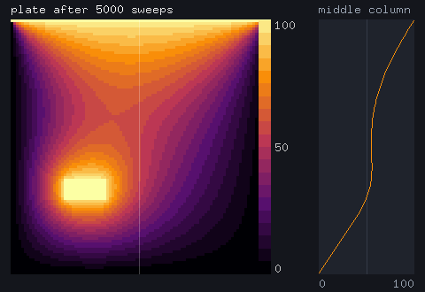
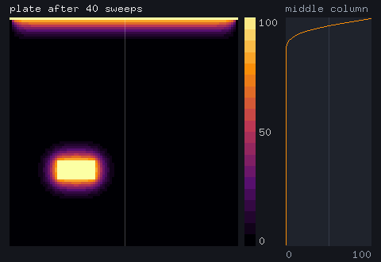
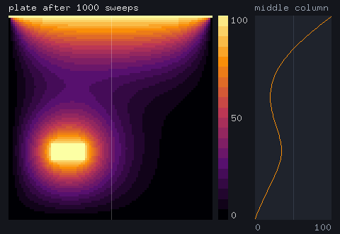

# Visual: an agent sees what a program draws, and fixes it

The plate viewer relaxes a small heat plate, 96 x 96 cells with a hot top edge and a heater block, and draws it after 0, 40, 200, 1000 and 5000 sweeps: the plate as a heat map, a colour bar, and the temperature down the middle column as a line. It draws on the CPU with `std.draw` and never opens a window. Under `cairn shot` each frame is written as a PNG beside a layout record, the rectangles the program says it drew.

`bar_x` has a planted defect: it places the colour bar inside the map's last columns, so the bar hides the plate's right edge.



```sh
make demo-visual                      # or: python3 demos/visual/run.py
cairn shot demos/visual --symbol heat.view.frame
```

## What happens

The layout test in `src/view.cairn` holds the panels apart, and it fails:

```text
$ cairn test demos/visual
tests-not-passed: 1 of 1 test failed
  test heat.view.layout: assertion failed at src/view.cairn:118: the colour bar does not cover the plate
```

The host opens a session on `bar_x` with the task "the colour bar hides the right edge of the plate". The packet holds `bar_x`'s source, the constant it uses, and the signature and effect row of its caller `frame`. The agent asks for a shot, and the host builds the program, runs it headless and returns each frame with its layout. The agent reads the overlap from numbers, not pixels:

```text
[bar_x] agent -> host: shot, with the effect row of heat.view.frame
[bar_x] host: shot, 5 frames; the last marks map x 12..300, bar x 292..306
[bar_x] agent -> host: body edit { return MAP_X + span + 8; }
[bar_x] host: typed, effect row [trap] within the ceiling
[bar_x] agent -> host: shot, with the effect row of heat.view.frame
[bar_x] host: shot, 5 frames; the last marks map x 12..300, bar x 308..322
    changed rows: {}
```

The second shot shows the bar clear of the map. `changed rows: {}` says the edit left `frame`'s effect row as it was: drawing a frame allocates, frees and runs a host region as before, and gains nothing such as `io`. The fixed program passes its test. These are its frames after 40, 1000 and 5000 sweeps:





## What is verified and what is not

The agent is scripted: its three requests are written in `run.py`. The shots, the admission, the effect rows and both test runs are computed on every run. `tests/projects/test_demos.py` runs the demo, checks the layout before and after, and compares every pixel of the frames it draws with the PNGs committed in `frames/`, so the pictures above are what the program draws today. `std.image` writes PNGs with stored zlib blocks; `run.py` recompresses the copies in `frames/` without changing a pixel. A shot needs no display and touches no GPU.
